# Question

What is the likely IPv4 address of someone from the Po1s0n1vy group scanning imreallynotbatman.com for web application vulnerabilities?

## Investigation Process

1. **Scenario briefing**  
   The task was to identify the attacker’s IP address scanning the domain `imreallynotbatman.com`.  

   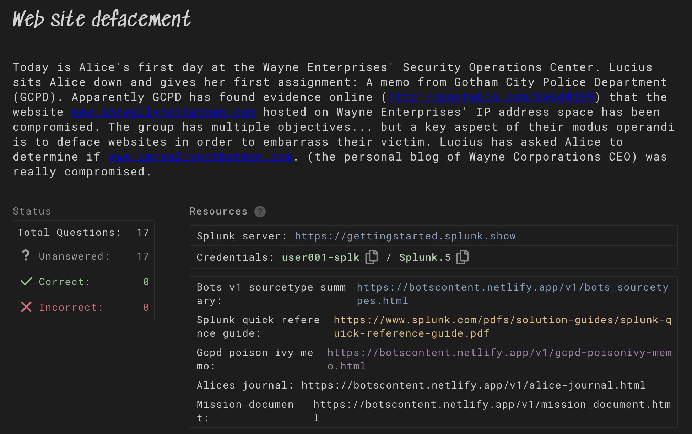

2. **Index and sourcetype check**  
   Within the `botsv1` index, sourcetypes such as `fgt_event`, `fgt_traffic`, `fgt_utm`, `stream:http`, and `suricata` were observed.  
   These sourcetypes contain web traffic and IDS/IPS data, which are critical for identifying attacker activity.  

   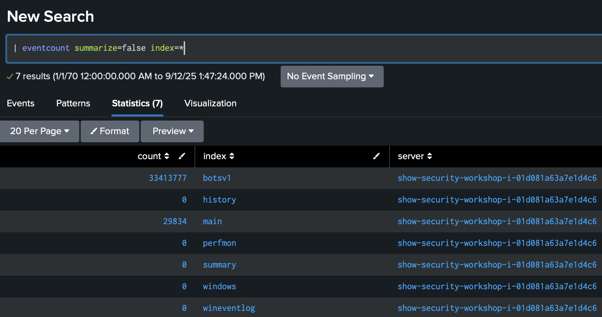  
   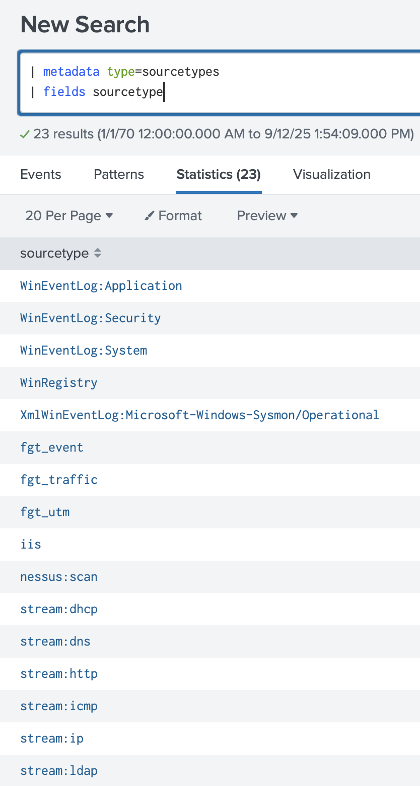  
   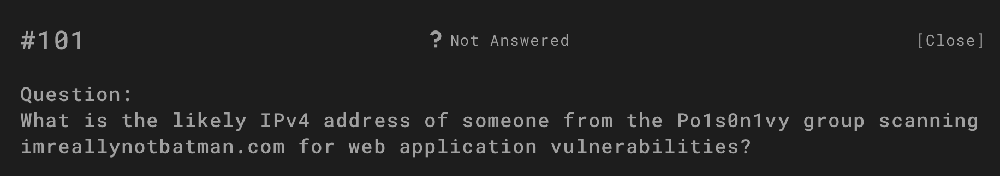
   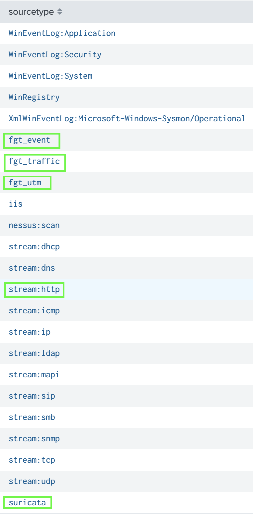  
   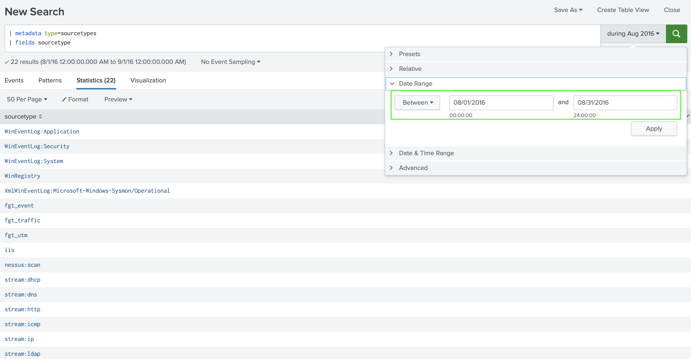

3. **Domain-specific search**  
   Query:  index=botsv1 sourcetype=fgt* “imreallynotbatman.com”

Suspicious access logs were found. The field `srcip` highlighted **40.80.148.42**.  

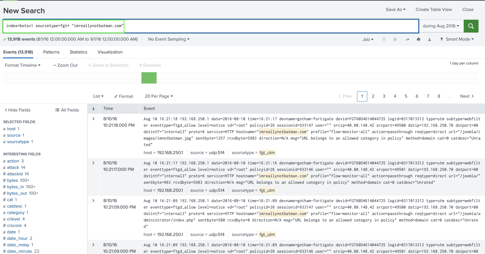
   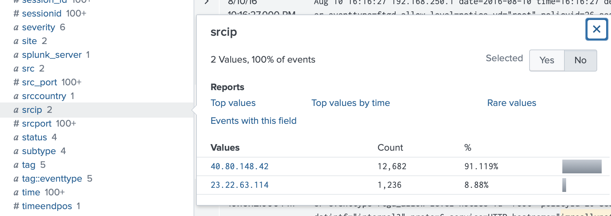

4. **SrcIP frequency analysis**  
Compared to other IPs, **40.80.148.42** generated ~91% of all requests.  
Another IP, **23.22.63.114**, appeared but its activity was much lower.  

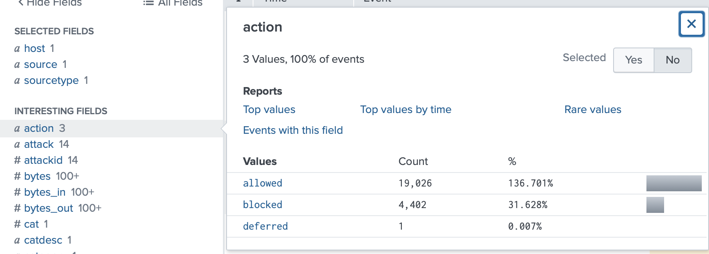  
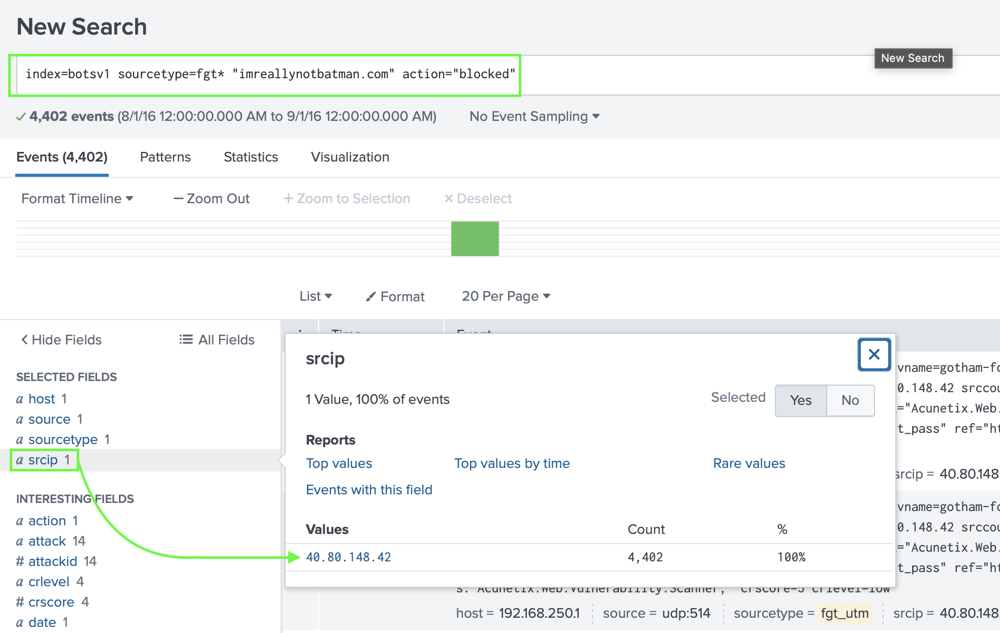

5. **Correlation – blocked events**  
Filtering with `action="blocked"` confirmed that **40.80.148.42** was blocked due to suspicious activity.  

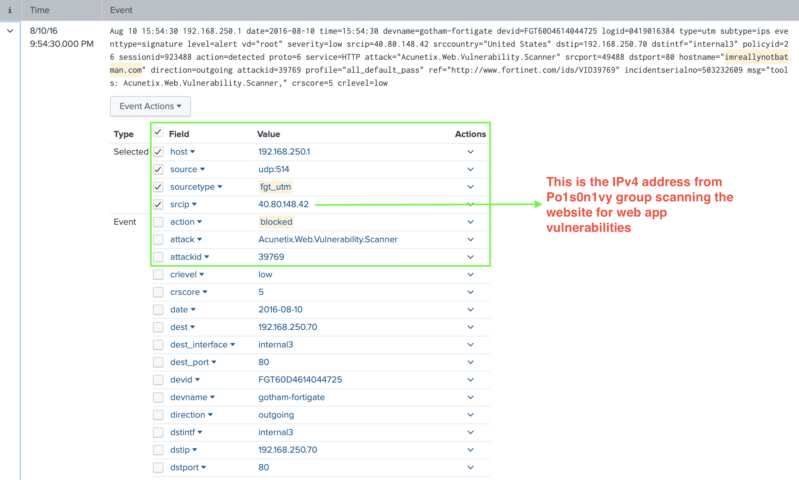

6. **Detailed event review**  
- User-Agent contained **acunetix_wvs_security_test** (vulnerability scanner).  
- URI paths like `/joomla/index.php` showed exploit attempts.  
- Suricata alerts flagged **XSS, SQL Injection, XXE, and Host Header Injection**.  

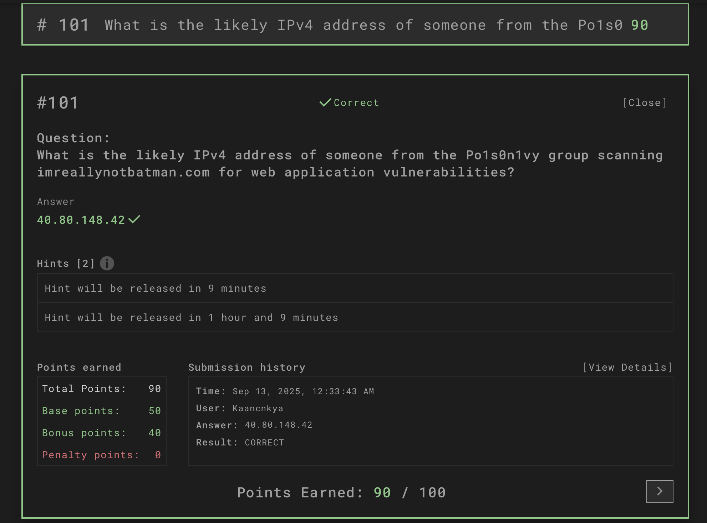  
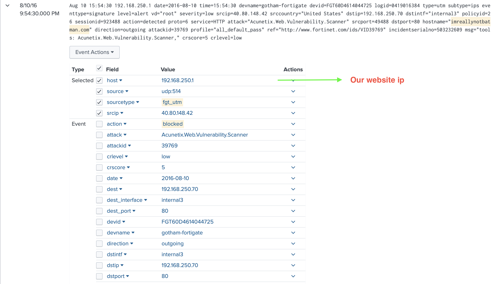  
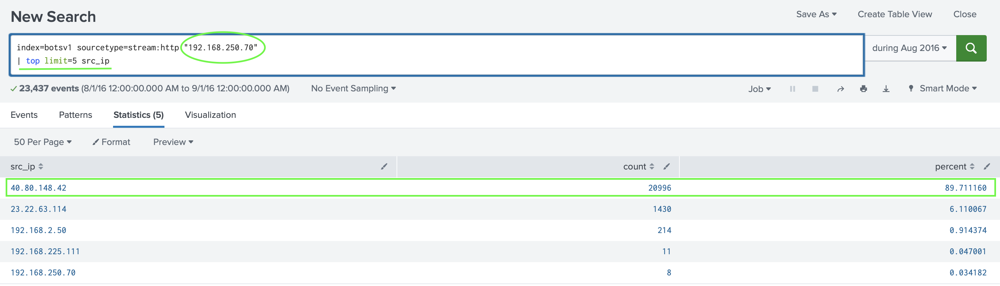  
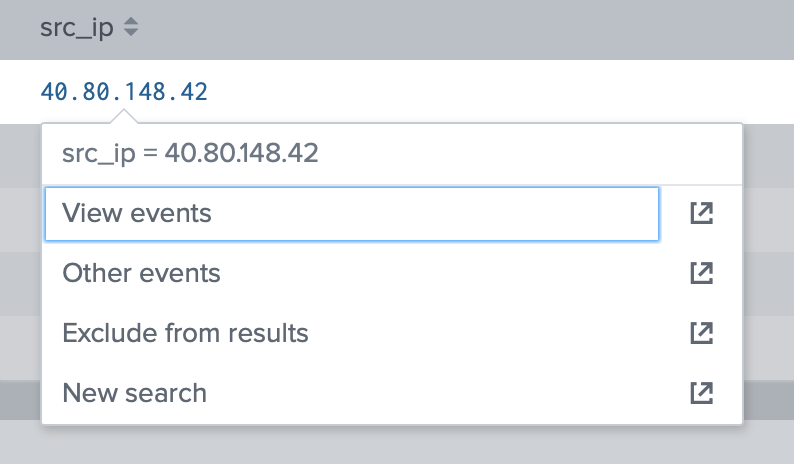  
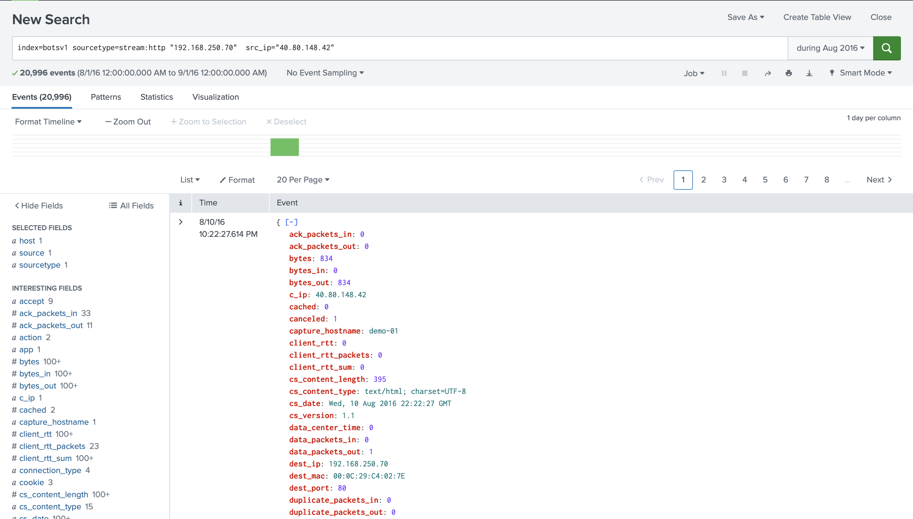

7. **Final correlation**  
Suricata queries directly tied multiple attack signatures to **40.80.148.42**, confirming it as the attacker’s IP.  

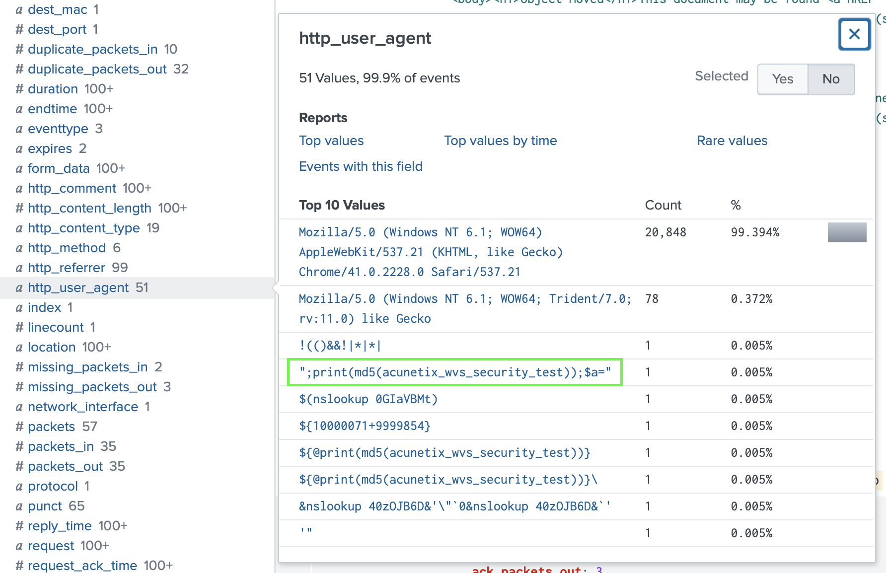  
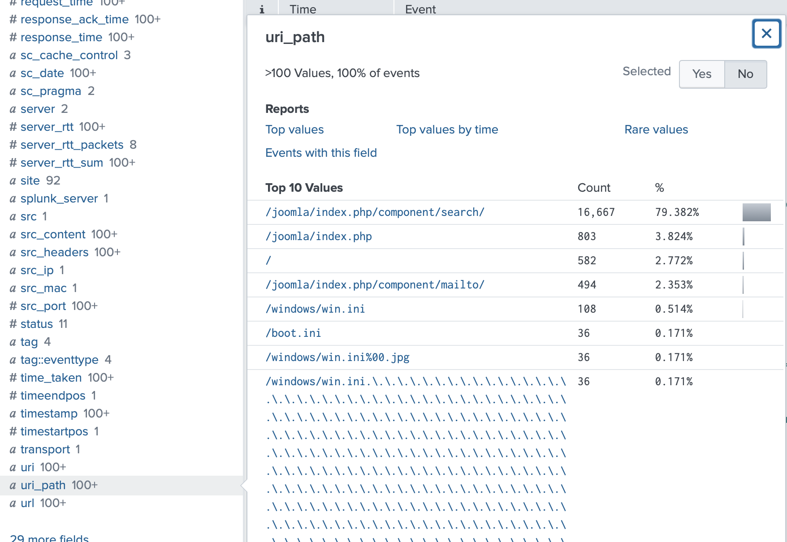  
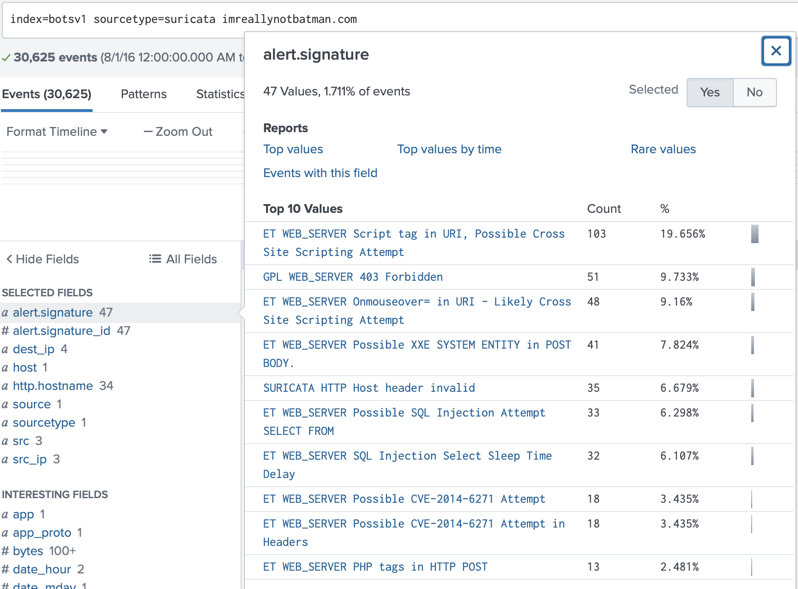  
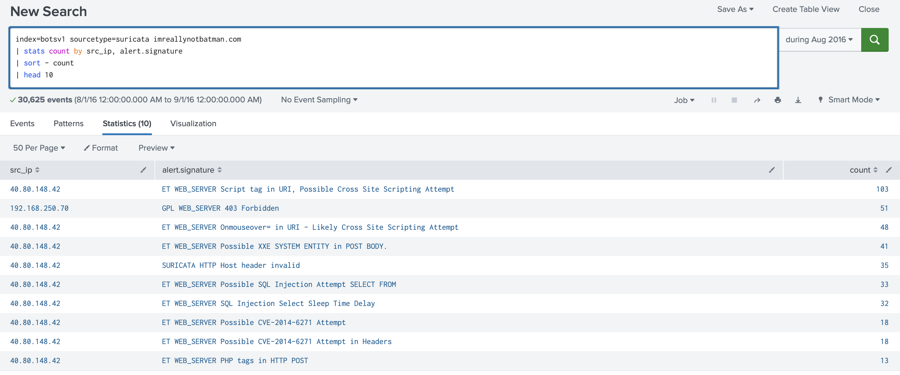

## Answer

**40.80.148.42**

## Evidence

All screenshots are stored in the `evidence/` folder (`0.png – 19.png`).

## Conclusion

The vulnerability scanning activity associated with the **Po1s0n1vy group** was traced back to **40.80.148.42**.  
This IP was confirmed through both **Fortigate (`fgt_utm`) logs** and **Suricata IDS alerts**, consistently linking it to malicious probing and exploitation attempts against `imreallynotbatman.com`.
