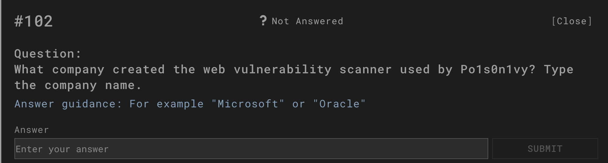
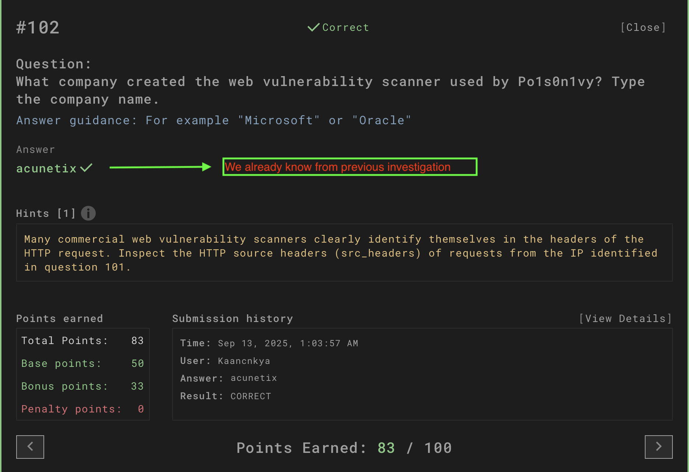

# Question

What company created the web vulnerability scanner used by Po1s0n1vy? Type the company name.

## Investigation Process

1. **Scenario briefing**  
   The goal was to determine which company created the vulnerability scanner used by the Po1s0n1vy group.  

   

2. **Review of previous findings**  
   From Question 101, we already observed in the HTTP headers that the **User-Agent** contained  
   `acunetix_wvs_security_test`, which is associated with the **Acunetix** vulnerability scanner.

3. **Validation**  
   Confirming with the challenge system, the scanner was indeed identified as **Acunetix**.  

   

## Answer

**Acunetix**

## Evidence

All screenshots are stored in the `evidence/` folder (`2.1.png – 2.2.png`).

## Conclusion

The Po1s0n1vy group used the **Acunetix** web vulnerability scanner during their attack activity.
This was confirmed through both HTTP request headers (User-Agent string) and challenge validation.
