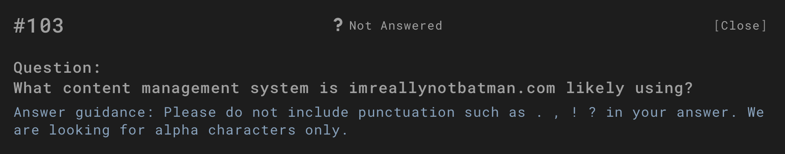
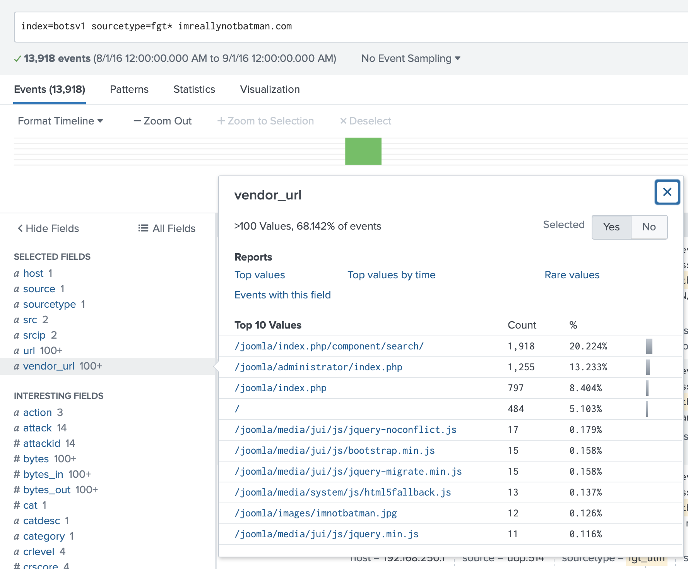
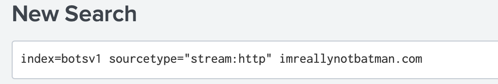
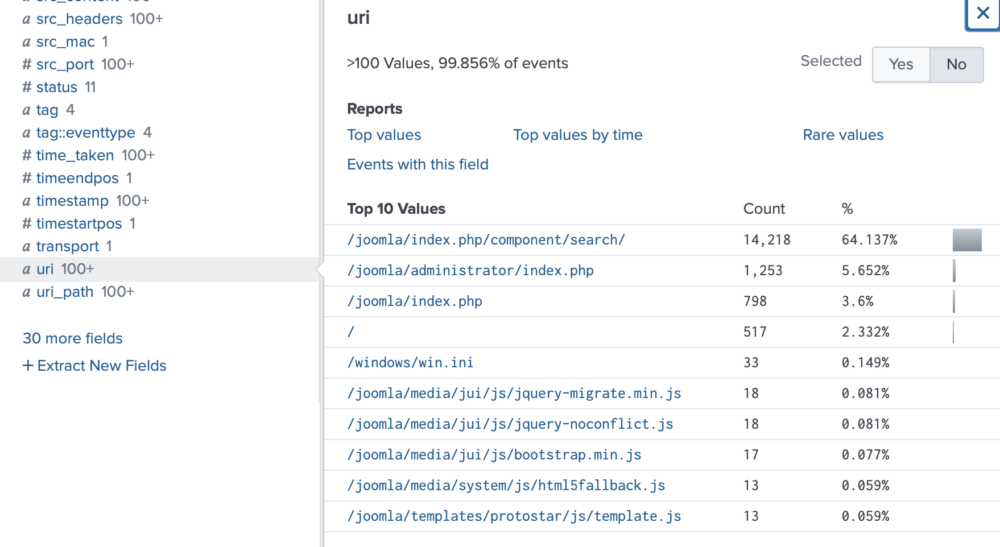
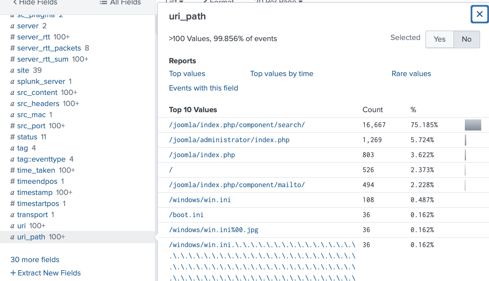
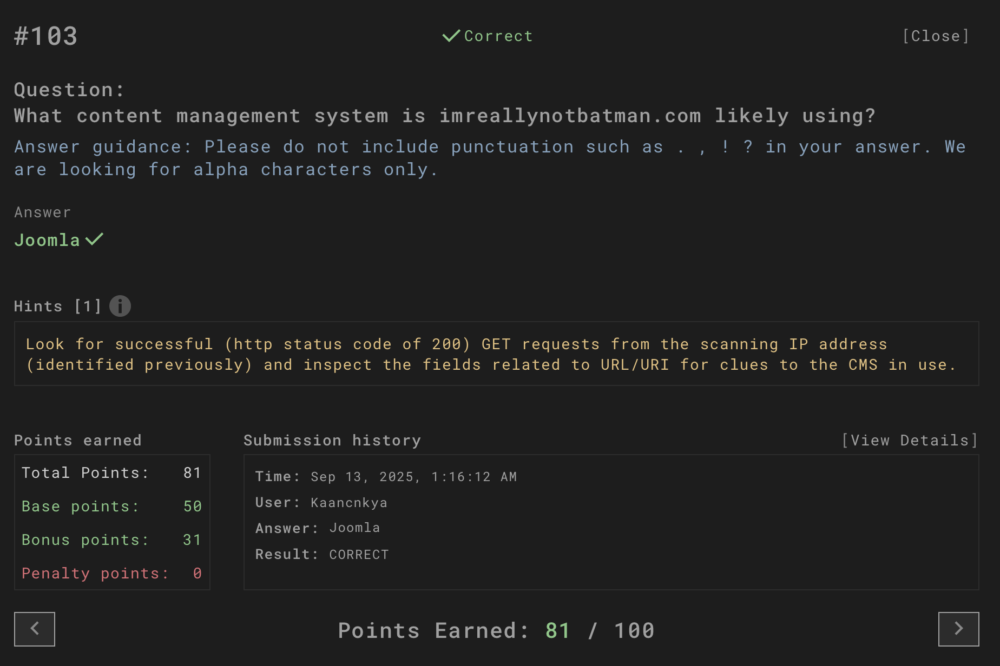

# Question

What content management system is imreallynotbatman.com likely using?

---

## Investigation Process

1. **Query preparation**  
   The task was to determine the CMS used by the domain `imreallynotbatman.com`.  
   We searched HTTP logs in the `botsv1` index across relevant sourcetypes.  

   

2. **Vendor URL analysis**  
   Looking into the `vendor_url` field showed multiple hits pointing to **`/joomla/` paths** such as:  
   - `/joomla/index.php/component/search/`  
   - `/joomla/administrator/index.php`  
   - `/joomla/index.php`  

   This strongly indicated that Joomla was being used as the CMS.  

   

3. **Cross-validation with stream:http logs**  
   Running the query against `stream:http` confirmed repeated requests to Joomla directories.  

   

4. **URI and path breakdown**  
   Reviewing the `uri` and `uri_path` fields showed that over **64%** of traffic went to `/joomla/index.php/component/search/`.  
   Other Joomla-related directories were also frequently accessed.  

     
   

5. **Final confirmation**  
   The challenge validation screen confirmed that the correct CMS was **Joomla**.  

   

---

## Answer

**Joomla**

---

## Evidence

All related screenshots are stored in the `evidence/` folder (`3.1.png – 3.6.png`).

---

## Conclusion

The analysis of both `vendor_url` and `uri/uri_path` fields confirmed repeated Joomla-specific directories.  
Therefore, the CMS running on `imreallynotbatman.com` is **Joomla**.
