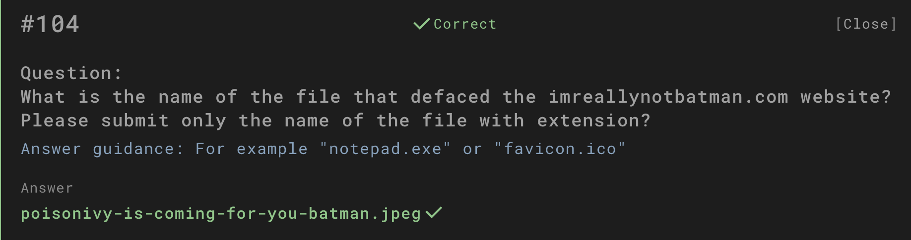

# Question

What is the name of the file that defaced the imreallynotbatman.com website?  
Please submit only the name of the file with extension.

## Investigation Process

1. **Scenario briefing**  
   The task was to identify the exact file used to deface the `imreallynotbatman.com` website.  

   

2. **Traffic analysis setup**  
   A Splunk query was run to filter traffic directed at the victim host (`192.168.250.70`) from the attacker IPs previously identified (`40.80.148.42` and `23.22.63.114`).  

   

3. **HTTP method review**  
   The results showed heavy use of the `POST` and `GET` methods. This indicates that files or payloads may have been uploaded to the server.  

   

4. **Event type filtering**  
   Filtering by `event_type`, it became clear that one category of logs was `fileinfo`, which reveals file uploads or modifications.  

   

5. **File identification**  
   Drilling into the `fileinfo` events revealed a suspicious file uploaded to the server:  
   `/poisonivy-is-coming-for-you-batman.jpeg`  

   

6. **Validation**  
   This matches the defacement file that altered the `imreallynotbatman.com` homepage. The filename is consistent with the Po1s0n1vy group’s signature style.  

   

## Answer

**poisonivy-is-coming-for-you-batman.jpeg**

## Evidence

All related screenshots are stored in the `evidence/` folder (`4.1.png – 4.6.png`).

## Conclusion

The defacement of `imreallynotbatman.com` was executed using the file  
**`poisonivy-is-coming-for-you-batman.jpeg`**.  
Log correlation confirmed that this file was uploaded from attacker IPs and directly tied to the defacement activity.
