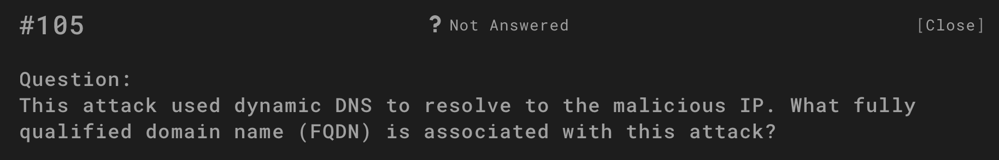
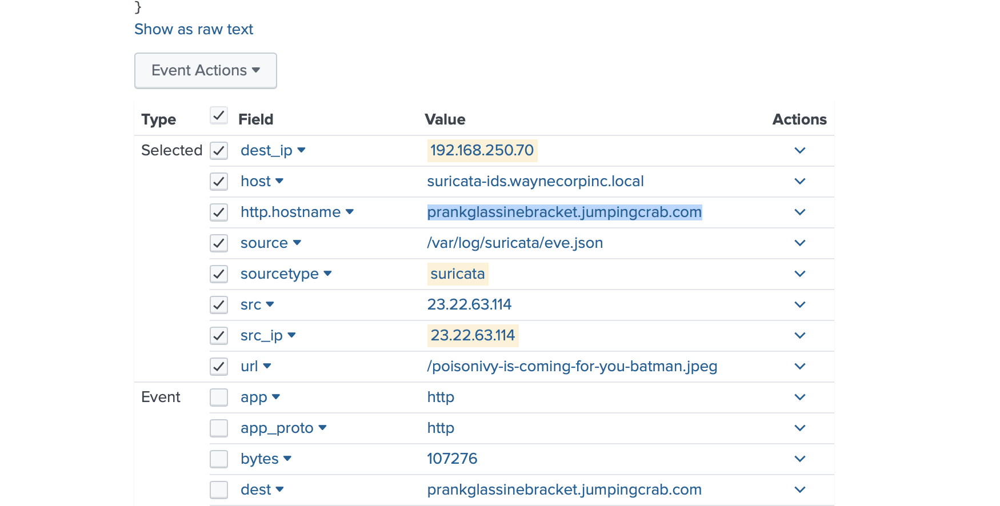
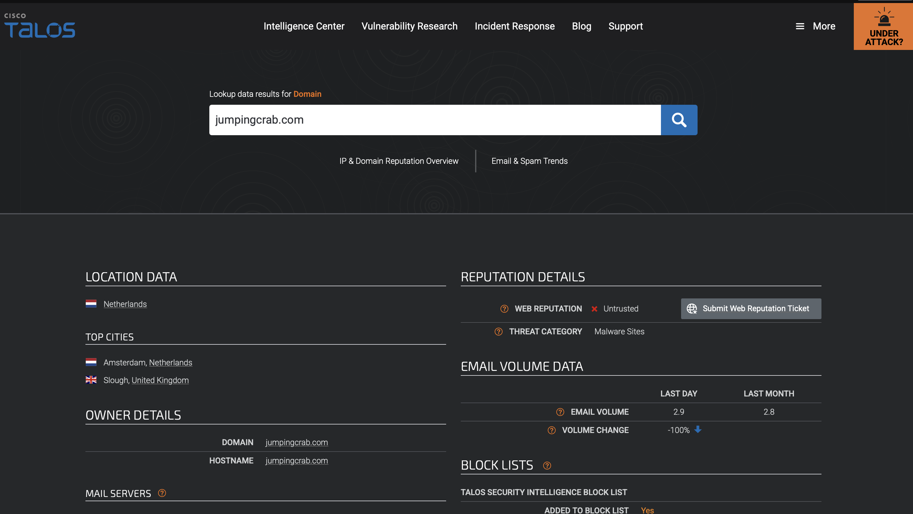
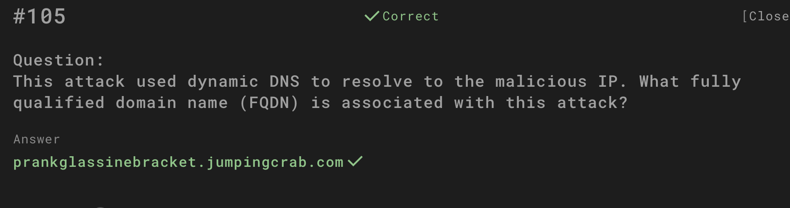

# Question

This attack used dynamic DNS to resolve to the malicious IP.  
What fully qualified domain name (FQDN) is associated with this attack?

## Investigation Process

1. **Scenario briefing**  
   The task was to identify the FQDN used in the attack, which leveraged dynamic DNS to resolve to a malicious IP.

   

2. **Suricata event inspection**  
   Reviewing logs for the attacker’s traffic (from previously identified IP `23.22.63.114`) revealed HTTP requests to a host value:  

   **`prankglassinebracket.jumpingcrab.com`**

   

3. **Host and domain breakdown**  
   The extracted host string showed a subdomain (`prankglassinebracket`) under the dynamic DNS provider domain (`jumpingcrab.com`).  
   This indicates the adversary registered and used a disposable subdomain for command-and-control / web delivery.  

   

4. **Reputation check**  
   A Cisco Talos lookup confirmed that `jumpingcrab.com` is associated with **malware sites** and flagged as **untrusted**.  
   This reinforces its use as infrastructure in the Po1s0n1vy campaign.  

   

## Answer

**prankglassinebracket.jumpingcrab.com**

## Evidence

All screenshots are stored in the `evidence/` folder (`5.1.png – 5.4.png`).

## Conclusion

The attack leveraged dynamic DNS infrastructure to disguise malicious activity.  
The fully qualified domain name (FQDN) directly associated with this campaign was identified as:  

**`prankglassinebracket.jumpingcrab.com`**,  
linking the Po1s0n1vy group’s scanning and defacement activities to malicious infrastructure hosted under the `jumpingcrab.com` domain.
