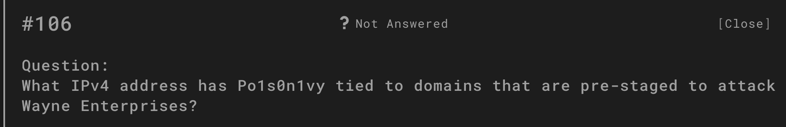
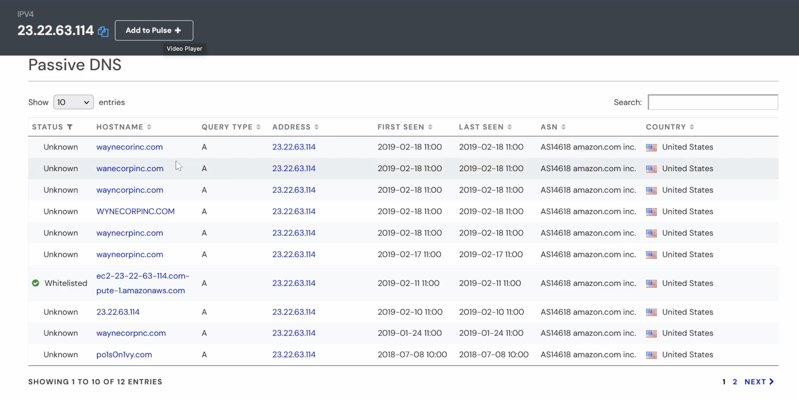
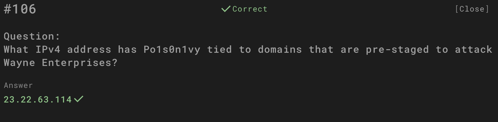

# Question

What IPv4 address has Po1s0n1vy tied to domains that are pre-staged to attack Wayne Enterprises?

---

## Investigation Process

1. **Passive DNS review**  
   Passive DNS analysis was conducted on Po1s0n1vy-related infrastructure.  
   Multiple suspicious domains resembling *Wayne Enterprises* were observed resolving to a single IP address.

   

2. **Suspicious domains**  
   Domains such as:  
   - `waynecorpinc.com`  
   - `wanecorpinc.com`  
   - `wayncorpinc.com`  
   - `waynecrpinc.com`  
   - `wayneorpinc.com`  
   - `waynecorpnc.com`  
   - `po1s0n1vy.com`  

   were all tied to the same IPv4 address.

   

3. **Confirmation of association**  
   All of these domains pointed to **23.22.63.114**, linking Po1s0n1vy’s infrastructure to pre-staged phishing/attack campaigns against Wayne Enterprises.

   

---

## Answer

**23.22.63.114**

---

## Evidence

Screenshots are stored in the `evidence/` folder (`6.1.png – 6.3.png`).

---

## Conclusion

Po1s0n1vy used several typo-squatted and lookalike domains targeting Wayne Enterprises.  
All domains resolved back to the IPv4 address **23.22.63.114**, confirming its role in the campaign’s infrastructure.
