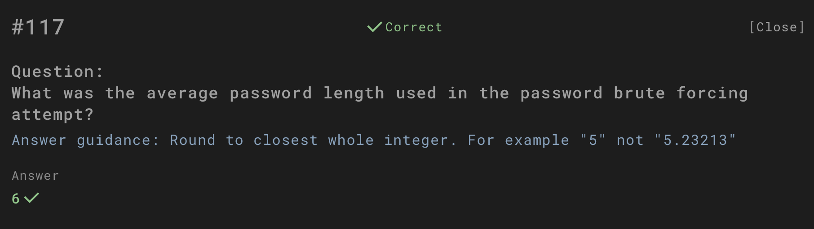
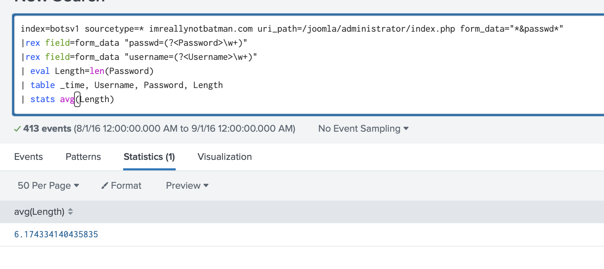
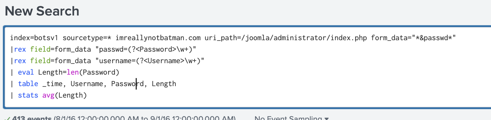

# Question

What was the average password length used in the password brute forcing attempt?

---

## Investigation Process

1. **Password brute force analysis**  
   A search was run on the `botsv1` index targeting requests to  
   `/joomla/administrator/index.php` where password fields were captured.  

   

2. **Extracting password data**  
   Using `rex` and `eval`, password values were parsed and their lengths calculated.  

   

3. **Calculating average password length**  
   The `stats avg(Length)` function returned an average length of **6.17** across 413 attempts.  

   

---

## Answer

**6**

---

## Conclusion

The brute force attempt leveraged weak passwords with an average length of **6 characters**.  
This short length highlights poor password hygiene, making brute force attacks more effective.
