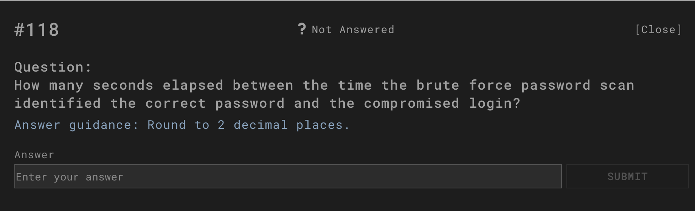
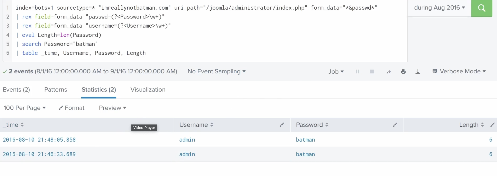
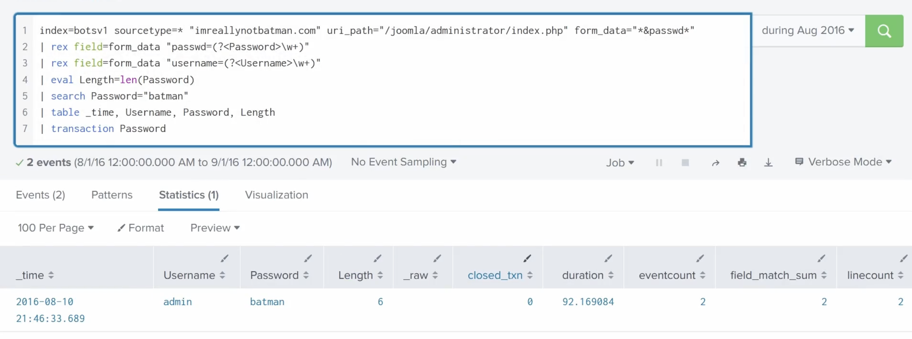
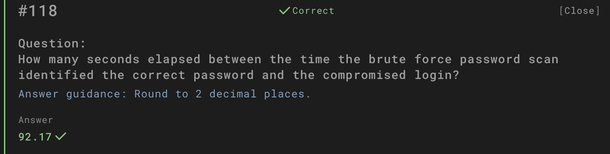

# Question 118

How many seconds elapsed between the time the brute force password scan identified the correct password and the compromised login?  
*(Round to 2 decimal places)*

---

## Investigation Process

1. **Extracting password attempts from logs**  
   We ran a query in the `botsv1` index focusing on Joomla admin login attempts with `form_data` containing both `username` and `passwd`.  
   This query revealed attempts where the attacker tested different passwords.  

   

---

2. **Correct password discovery event**  
   From the query results, we identified the moment the brute force scan successfully guessed the correct password `batman` for user `admin`.  
   The timestamp of this event was: **2016-08-10 21:46:33.689**.  

   

---

3. **Compromised login event**  
   Shortly after, we observed a successful login event using the cracked credentials.  
   The timestamp of the compromised login was: **2016-08-10 21:48:05.858**.  

   

---

4. **Calculating elapsed time**  
   Using the `transaction Password` SPL command, we measured the duration between the two events.  
   The difference came out to **92.169084 seconds**, which rounds to **92.17 seconds** (2 decimal places).  

   

---

## Answer

**92.17 seconds**

---

## Evidence

All screenshots are stored in the `evidence/` folder (`18.1.png – 18.4.png`).

---

## Conclusion

The brute force attack discovered the correct password `batman` for user `admin` at **21:46:33.689**.  
The attacker then successfully logged in with these credentials at **21:48:05.858**.  
The elapsed time between password discovery and successful login was **92.17 seconds**.
