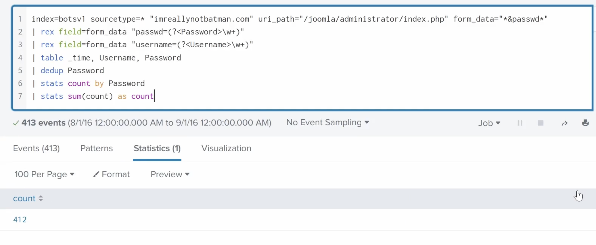

# Question

How many unique passwords were attempted in the brute force attempt?  

---

## Investigation Process

1. **Brute force detection setup**  
   To analyze brute force activity, we searched for HTTP POST requests against the Joomla administrator login page:  
index=botsv1 sourcetype=* imreallynotbatman.com uri_path=”/joomla/administrator/index.php” form_data=”&passwd”
'''
| rex field=form_data “passwd=(?\w+)”
| rex field=form_data “username=(?\w+)”
| table _time, Username, Password
| dedup Password
| stats count by Password
| stats sum(count) as count
'''

This query extracts attempted passwords, removes duplicates, and counts the unique values.

2. **Events count**  
Splunk returned **413 total events**, which aligns with brute force activity.

3. **Unique password calculation**  
After deduplication and aggregation, the final result shows:  

**412 unique passwords** were attempted.  

---

## Answer

**412**

---

## Evidence

- `19.1.png` → Query showing deduplication and stats aggregation.  
- `19.2.png` → Splunk output with total 413 events leading to 412 unique passwords.

---

## Conclusion

The brute force attack against `imreallynotbatman.com` attempted **412 unique passwords**, confirming the scale of the attack and highlighting the persistence of the adversary.
